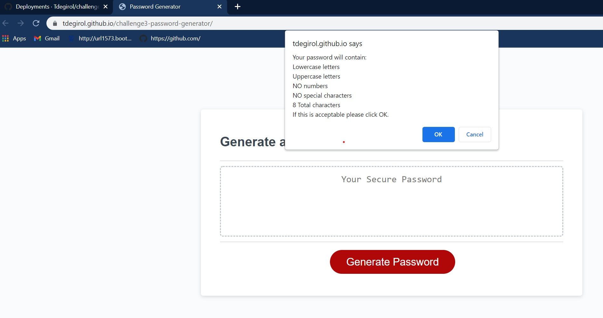
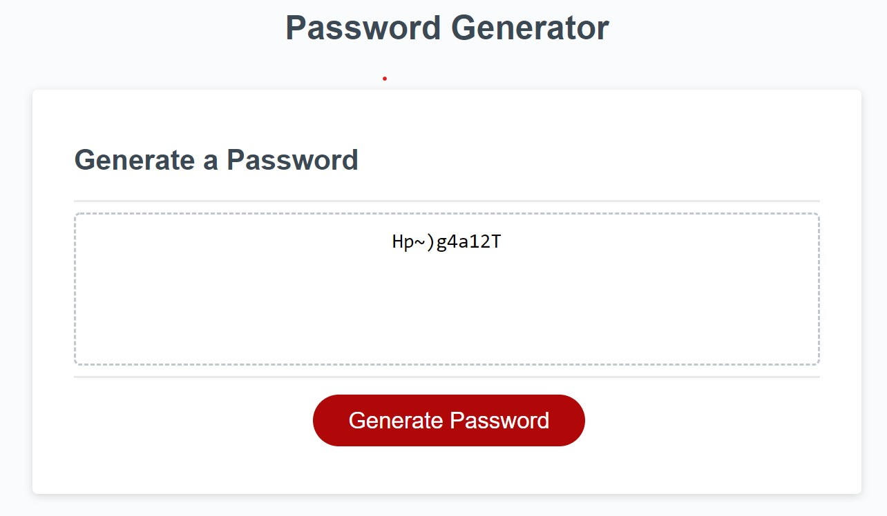

# challenge3-password-generator

## Introduction

Challenge 3 has been an opportunity to primarily apply logic to create a program. Instead of getting creative and building a website, this is an application of javascript to generate a random password that is based on criteria provided by the user.

## Installation

To install this project, clone the repository:
    git@github.com:Tdegirol/challenge3-password-generator.git

To visit the webpage on github please follow the link below:
    https://github.com/Tdegirol/challenge3-password-generator

To view the website please follow the link below:
    https://tdegirol.github.io/challenge3-password-generator/

## Usage

This project is a random password generator. Depending on the criteria that the user selects, the password can be between 8 and 128 characters, contain lowercase letters, uppercase letters, numbers, or special characters - as shown below:

The final password is randomly selected based on the user's input. Each character is a random choice that may be any of the possible inputs the user has declared. One example of a 10 character long password with any possible character type is shown below:

## Credits

Our professor and TA's! Rommel, Charlie, and Donnahue through class and office hours.
